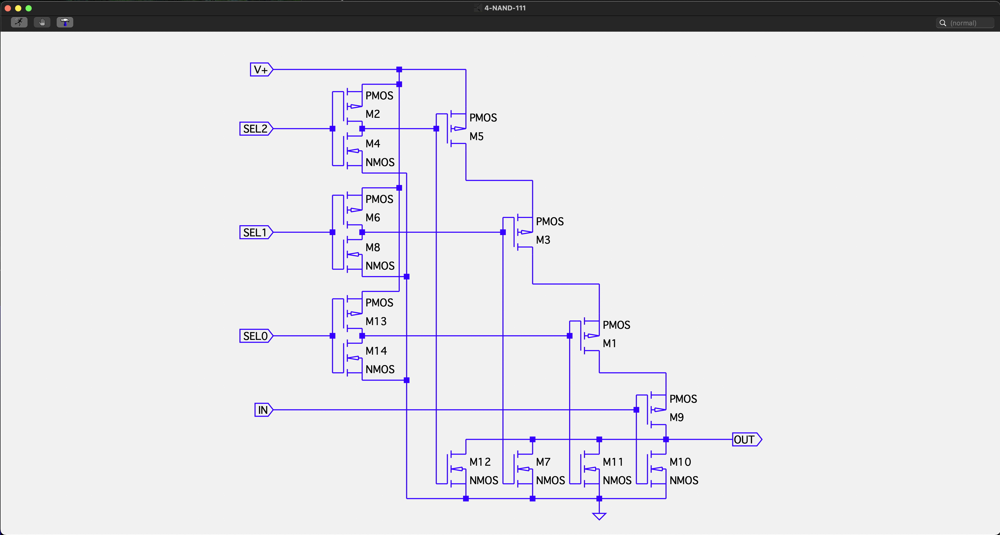
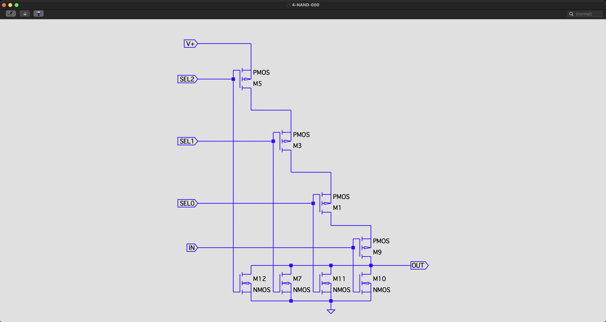
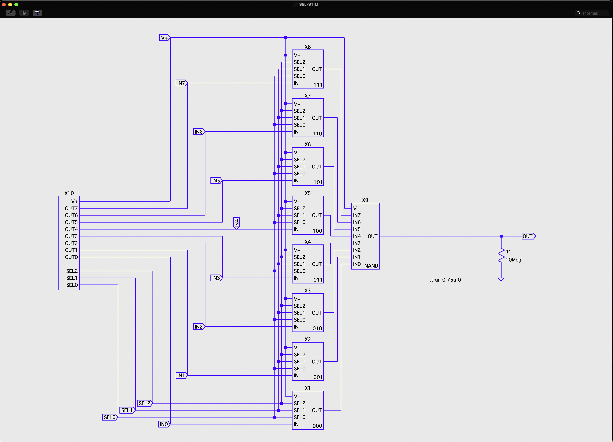

# FPGA-tech-selector
LTSpice files for simulating a 1 of 8 selector using MOSFET transistors in CMOS pairs.

These are the files for the article published on LinkedIn.  To get started, download and install
the free LTSpice tool from Analog Devices.  Start that program and open SEL-STIM.asc.  Hit the
'run' icon in the upper left of the window.  Enjoy!

FPGA tech: Building a selector

Someone asked me how a selector is built inside an FPGA. Looking back, I think either I did not describe it very well or I did not answer the question he was asking, so I decided to put a more complete reply here.

A selector is just an electronic way of muxing several input signals together into a single output. Back when electronics were built with discrete ICs--that is, without an FPGA--we could buy an IC that would give us this functionality. Today, we write some HDL--that looks a bit like C-language code--and the FPGA tools synthesize our source into an electronic circuit that does what we want. The question is, what does the finished circuit look like for a selector implemented in an FPGA? And starting out, what was inside the discrete IC?

For an 8-input selector, you need three bits of address, which are ports SEL0, SEL1 and SEL2 in the schematics. These schematics were all created in LTSpice, which is a brilliant and free piece of software that allows you to construct and simulate electronic circuits of all types. If the correct bit-address appears on those ports--which is the address 111 for the first schematic--the input port shows up on the output port, but inverted (a high input gives a low output and vice versa), making this a NAND circuit built from NMOS and PMOS transistors in CMOS pairs. When the address is anything other than 111, the output sits idle with a 1 output. This is just one way to create a selector from transistors. If you want to know more about the basics of CMOS, let me know and I will put it in a future article.

The first circuit takes care of one input, which has the address 111. There is another one of these circuits that is very similar for each address. The circuits vary by which SEL input ports have inverters, which sets the address of the circuit. For address 111, all three SEL ports have inverters, which is the first CMOS pair on each port. For the second circuit, which has no inverters, the address is 000. Every other circuit has its address set by the combination of inverters on the SEL inputs.

One of the nice things about LTSpice is that it allows us to take a schematic like this and package it into a sub-circuit, and then pull multiple sub-circuits together into the larger circuit as you see below.

On the left side you see a simulation stimulator, which generates different frequency, continuous square waves on each of its OUT ports so we can tell them apart in the display of simulation output. It also counts down the addresses from 111 to 000 on the SEL ports.

The next column of sub-circuits in the larger circuit is the single-bit selectors we have looked at so far, with the address written in the lower right corner of each sub-circuit.

The last subcircuit in the larger circuit takes the output of whichever selector is addressed, and passes it on, inverted to the output port. This last subcircuit is an 8-input NAND, which is identical to the selector circuit at address 000, but it has 8 inputs instead of 4.

In total, we invert the input twice in this larger circuit, canceling out the inversion. We make these inversions because it takes fewer transistors to complete the design than if we did not invert the input: another topic for a discussion of basic CMOS logic.

Now with the various sub-circuits created and instantiated, we are ready to simulate. Push the little running man icon at the upper left of the window, and less than 10 seconds later--for this very simple circuit--the simulation is complete. I then go back and use the GUI to add simulation probes to the points in the circuitry I am interested in seeing. When I do, their waveforms appear in the simulation output window.

After verifying that the output was what I expected, I probed each of the outputs of the single-bit selectors where they lead to the 8-input NAND.

If the implementation was broken, on the OUT port I would either see an idle 1 output, an idle 0 output or a mixture of different inputs fighting over the OUT port at the same time, causing intermediate voltages and non-square wave waveforms. Instead, what we see correctly is each of the input frequencies driving the output in rotating fashion as each address of the selector it chosen.

OK, now I know it is hard to see the next great trade in an image like that, but believe me, this is great progress. In part 1 of this article we have created and simulated the functionality of a discrete IC for a 1 of 8 selector. Now that we understand what that circuit is, we can modify the schematics a bit and simulate how an FPGA might approach the same problem. That will be the subject of part 2 of this article.

If you want a copy of all of the source files that went into these circuits and the simulation, you can find them on my GitHub repo: https://github.com/dwisehart/FPGA-tech-selector

